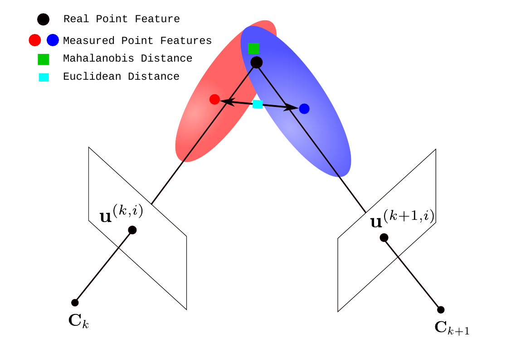

# What?

**CoVO** is a Visual Odometry tool that uses RGB-D images to estimate the *relative pose* (position and orientation) of a camera and the *covariance* of the pose estimation.

# Why?

**CoVO** was built because there was no Visual Odometry tool that can provide *uncertainty* of pose estimations.

# How?

**CoVO** uses sensor noise models of the camera to propagate the measurement errors (epistemic uncertainty) to estimate covariances.




# Installation Guide

### Dependencies

You need to install following libraries:

- [Eigen3](http://eigen.tuxfamily.org/index.php?title=Main_Page) - version 3.3.x
- [OpenCV](https://docs.opencv.org/3.4/d7/d9f/tutorial_linux_install.html) - version 3.4.1
- [Ceres](http://ceres-solver.org/installation.html) - version 1.14.0

You don't need to install following libraries since they are kept in thirdparty folder locally:

- [spdlog](https://github.com/gabime/spdlog) - version 1.x
- [moderncpp json](https://github.com/nlohmann/json) - version 3.4.0
- [args](https://github.com/Taywee/args) - version 6.0.4

Let's install dependencies and then CoVO.

#### OpenCV

Follow this tutorial to build it from source [OpenCV](https://www.learnopencv.com/install-opencv3-on-ubuntu/)

**IMPORTANT**: Be careful with the version you install and pay attention as to which branch you are in before installing so don't forget to run the following command:

```
$ git checkout 3.3.1 
```

**RECOMMENDATION**: instead of using "make install" command, use 'checkinstall' which creates a '.deb' packages so that you easily uninstall it in case somethings goes wrong. "make install" command usually distributes file copies in an ugly fashion:

```
$ sudo checkinstall
```

#### Eigen3

Install the binary package 

```
$ sudo apt-get install libeigen3-dev
```

#### Ceres

Follow the official tutorial to build it from source [Ceres-Solver](http://ceres-solver.org/installation.html)

**IMPORTANT**: Be careful with the version you install and pay attention as to which branch you are in before installing so don't forget to run the following command:

```
$ git checkout 1.14.0 
```

#### CoVO

Finally, to build CoVO:

```
git clone https://github.com/ugurbolat/CoVO.git
cd CoVO
mkdir build
cd build
cmake ..
make -j8
```


# Usage Instructions

If you made it so far without compilation errors, congrats! I know it was not easy :) 

If compiled right, you should have the binary file in the *build/bin* folder. In order for CoVO to run, you need RGB-D images. In this project, TUM RGB-D datasets folder structure is used. Go ahead and download **fr1/xyz** sequence (since SETTINGS.json includes camera intrinsic parameters as a default) from:

https://vision.in.tum.de/data/datasets/rgbd-dataset/download

Then, execute **covo_bin** file from the command line. For example, a basic command should look like:

```
$ ./covo_bin -d /path/to/rgbd_dataset_freiburg1_xyz/
```

this should take RGB and depth images and output pose and covariance estimation into txt file:

- Relative Transformations (covo_rel_trans.txt):

  | Timestamp         | Position X (in m) | Position Y (in m) | Position Z (in m) | Orientation -Quaternion X | Orientation -Quaternion Y | Orientation -Quaternion Z | Orientation -Quaternion W |
  | ----------------- | ----------------- | ----------------- | ----------------- | ------------------------- | ------------------------- | ------------------------- | ------------------------- |
  | 1305031102.211214 | -0.002386         | 0.010023          | 0.013724          | -0.001312                 | -0.003174                 | -0.001397                 | 0.999993                  |
  | 1305031102.275326 | 0.000577          | -0.004053         | 0.024954          | -0.013117                 | -0.006330                 | 0.000905                  | 0.999894                  |

- Trajectory (or Absolute Transformations) (covo_trajectory.txt):

  | Timestamp | Position X (in m) | Position Y (in m) | Position Z (in m) | Orientation -Quaternion X | Orientation -Quaternion Y | Orientation -Quaternion Z | Orientation -Quaternion W |
  | --------- | ----------------- | ----------------- | ----------------- | ------------------------- | ------------------------- | ------------------------- | ------------------------- |
  | 1305031102.175304 | 0.000000 | 0.000000 | 0.000000 | 0.000000 | 0.000000 | 0.000000 | 1.000000 |
  | 1305031102.211214 | -0.002386 | 0.010023 | 0.013724 | -0.001312 | -0.003174 | -0.001397 | 0.999993 |
  | 1305031102.275326 | -0.001978 | 0.006034 | 0.038692 | -0.014440 | -0.009484 | -0.000525 | 0.999851 |

- Covariances (covo_rel_cov):

  |            | Pos X        | Pos Y         | Pos Z        | Quat X        | Quat Y        | Quat Z        |
  | ---------- | ------------ | ------------- | ------------ | ------------- | ------------- | ------------- |
  | **Pos X**  | 0.0000056389 | -0.0000005284 | 0.0000003116 | -0.0000003563 | -0.0000019992 | 0.0000008177  |
  | **Pos Y**  |              | 0.0000081934  | 0.0000031681 | 0.0000029919  | -0.0000000801 | 0.0000003453  |
  | **Pos Z**  |              |               | 0.0000054846 | 0.0000010352  | -0.0000005458 | 0.0000003357  |
  | **Quat X** |              |               |              | 0.0000011555  | 0.0000000343  | -0.0000000087 |
  | **Quat Y** |              |               |              |               | 0.0000007731  | -0.0000003002 |
  | **Quat Z** |              |               |              |               |               | 0.0000006722  |

  

You can also provide CoVO more arguments, if you like:

```
./covo_bin -d /path/to/rgbd_dataset_freiburg1_xyz/ -i 10 --draw-matches -t 0
```

this should take 10 consecutive images, while drawing the key point matches with users control.

For more information about the arguments, use -h argument:

    Welcome to CoVO!
    CoVO is an Uncertainty-Aware RGB-D Visual Odometry Tool
    For more information visit https://github.com/ugurbolat/CoVO
      OPTIONS:
      -h, --help                        Display help menu
      -s[/path/to/SETTINGS.json],
      --settings=[/path/to/SETTINGS.json]
                                        Configuration file of CoVO's settings;
                                        e.g., camera intrinsics, sensor noise
                                        model etc.
                                        Default SETTINGS.json located in
                                        params_settings folder
      -d[/path/to/dataset_dir],
      --dataset_dir=[/path/to/dataset_dir]
                                        Dataset root directory.
                                        Default dataset located in docs folder
      -l[trace, debug, info, warn,
      error, critical],
      --log_level=[trace, debug, info,
      warn, error, critical]            Log level settings.
                                        Default is at info level
      -o[/path/to/output_dir/],
      --output_dir=[/path/to/output_dir/]
                                        Output directory in which CoVO results
                                        will be saved
                                        Default is './'
      -i[1,2,...,all],
      --no_imgs=[1,2,...,all]           No of image pairs to be processed. An
                                        integer or all can be entered
                                        Default is all
      --draw-matches                    Enable flag for drawing matches on image
                                        pairs
                                        Default is disabled
      -t[delay in ms],
      --time_delay=[delay in ms]        Delay btw image readings. This
                                        functionality is only available if
                                        draw_matches is enabled
                                        Default is 0 which means it will wait
                                        indefinitely for key press to process
                                        next image pairs
